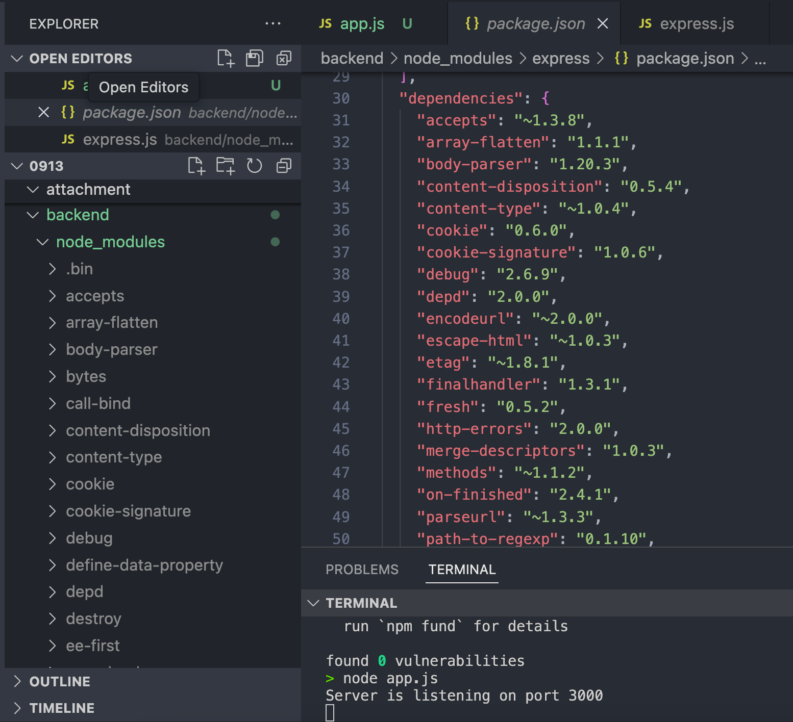

# Week-03 backend

## dependencies 與 devDependencies

> package.json 中的 dependencies 與 devDependencies 分別是什麼

dependencies 維護了這個專案會用到的 package 以及該 package 的版本，版本的部分有[彈性支援的語法](#dependencies-與版本)，不一定要直接寫死用某個版本，當執行 `npm install`就會依照版本安裝這些 packages。

```json
  "dependencies": {
    "express": "^4.21.0"
  }
```

`package.json` 中還有 **devDependencies** ，devDependencies 是 local 開發時才會用到的 package，例如跑測試用的 package。這樣區分的好處是如果其他人只是要用你的 module，但沒有要跑測試或進行 build 之類的開發行為，就可以不用下載 `devDependencies`。

平常用 `npm install [package]` 安裝套件時，預設會將 package 安裝到 `dependencies` ，如果要安裝的 package 只有在開發環境中會用到，可以用 `--save-dev` 指定要安裝的 package 是 `devDependencies`。

例如 Jest 是一個 Javascript 測試框架，在安裝時就會用到 `--save-dev`:

```shell
npm install --save-dev jest
```

總結來說，在 `package.json` 中：

- `dependencies`: 寫的程式本身就會直接用到的 package。
- `devDependencies`: local 開發會用到的 package，例如跑測試或 build code 會用到等等。

相關的 npm 安裝指令：

- `npm install`: 安裝所有 `dependencies` 和 `devDependencies`
- `npm install --production`: 只安裝 `dependencies`

## `package.json` 的 `scripts`

> package.json 中的 scripts 這個區塊怎麼用？

`scripts` 中的指令可以透過 `npm run [stage]` 執行。

例如以下是 `npm init` 所預設的 `scripts`：

```json
"scripts": {
	"test": "echo \"Error: no test specified\" && exit 1"
},
```

可以透過 `npm run test` 來執行 `echo \"Error: no test specified\" && exit 1`

```shell
> npm run test

> backend@1.0.0 test
> echo "Error: no test specified" && exit 1

Error: no test specified
```

### `pre` and `post`

在 npm 中，這些 scripts 的 key 被稱為 stage。特別的是我們可以也新增 `pre<stage>` 或 `post<stage>`，每當我們執行了 `npm run [stage]`，也會自動依照順序執行 `pre<stage>` 和`post<stage>`。

例如新增 `hello` stage 和 `prehello` 以及 `posthello`：

```json
  "scripts": {
    "hello": "echo hello npm",
    "prehello": "echo before",
    "posthello": "echo after"
  },
```

接著 `npm run hello`，可以看到除了 `hello`，`prehello` 也先被觸發，`posthello`也再最後被觸發：

```
> npm run hello

> backend@1.0.0 prehello
> echo before

before

> backend@1.0.0 hello
> echo hello npm

hello npm

> backend@1.0.0 posthello
> echo after

after
```

這樣自動觸發 pre 或 post 的 script 可以更方便地做 setup 與 clean up，像是測試之前要把東西開起來或測試跑完要把東西清掉等等。

## Environment variables: Setting the port number

> Port number 要怎麼以環境變數來設定？

環境變數可以將 config 從程式中獨立出來，讓 config 可以更方便的被管理與設定。node 程式的環境變數被存在 `process.env` 中，這些變數是在程式開始執行時決定的。

以下簡述如何將 `app.js` 的 port 改成讀取環境變數

1. 使用 `process.env.PORT` 告訴程式 port 這個變數要使用環境變數中的 `PORT`

```js
const port = process.env.PORT;
```

2. 提供環境變數，有兩種方法：

- 在執行時提供
- 提供 env-file（需要 node 版本 20 以上）

第一種方法，在執行時提供，用 `{ENV_NAME}={ENV_VALUE}` 的格式：

```shell
PORT=3000 node app.js
```

第二種方法，指定 `--env-file` 檔案

> [!NOTE]
> 這是 Node.js 20 之後才有的新功能

先建立一個 `.env`:

```
# .env
PORT=3000
```

並用 `--env-file` 提供 `.env` 檔執行：

```shell
node --env-file=.env app.js
```

第一種方法如果環境變數不多的話很方便，第二種方法更適合有多個環境變數，甚至多種 `.env` 檔案，例如測試用的 `.test.env`、正式環境用的 `.prod.env` ，直接指定檔案可以更方便的切換。

## 哪些檔案要被放到 Github repository

> 關於哪些檔案應該要被放上 github repo 這個問題，描述看看為什麼你選擇上傳某些檔案、選擇不上傳某些檔案，決策的要素是什麼？

**不上傳的檔案：可以被產生出來的檔案、機密資料（資料庫密碼等等）**

- `node_modules`: 可以透過 npm install 安裝 packages 產生
- `.env`: 目前的 `.env` 雖然只有 PORT number，但未來可能放入一些機密的資料，因此不上傳

**要上傳的檔案：寫出來的 code、需要協作、需要被 review、自動化流程需要的**

- `package-lock.json`: 這個檔案在 `node_modules` 每次有更動時就會自動修改，它描述了目前 `node_modules` 中 packages 的確切版本，可以讓不同的人或 CI pipeline 都可以用 `npm ci` 安裝到一致的 dependencies，而且 `npm ci` 是比 `npm install` 更優化的，因此 `npm ci` 很適合自動化流程使用，所以這個檔案是需要被 commit 的。 [參考來源](https://docs.npmjs.com/cli/v10/configuring-npm/package-lock-json)

> [!NOTE]
> backend 資料夾中的 `.gitignore` 是透過 [VSCode 插件 gitignore](https://marketplace.visualstudio.com/items?itemName=codezombiech.gitignore) 產生，這個插件會從 https://github.com/github/gitignore 下載指定類型的`.gitignore` 。

## CJS vs ESM

> 範例程式中用 require，但上週的 Stack 是用 import/export，這兩種分別是 JavaScript 引用模組的兩種方式: CJS vs ESM，這兩者分別怎麼用？

### CJS: Common JS

- 基本辨識方法（[實際上的辨識流程](https://nodejs.org/api/packages.html#determining-module-system)）：
  - 副檔名為 `.cjs`
  - 或是 `package.json` 中有 `"type": "commonjs"
- 使用
  - 用 `require()` 引入 module
  - 用 `exports` 、`module.exports` 匯出

### ESM: ECMAScript modules, ES modules

- 基本辨識方法：
  - 副檔名為 `.mjs`
  - 或是 `package.json` 中有 `"type": "module"
- 使用
  - 用 `import()` 引入 module
  - 用 `export`匯出

---

## 觀察 `pacakge.json` 在 `npm install` 後的變化

在 `npm install express` 後，`package.json` 的多出了 `license` 以及 `dependencies` 兩個部分:

```json
  "license": "ISC",
  "dependencies": {
    "express": "^4.21.0"
  }
```

其中`license` 指定的 [ISC](https://choosealicense.rustwiki.org/licenses/isc/) 是 npm package 預設的 license。

#### dependencies 與版本

而 `dependencies` 的 `express": "^4.21.0` 代表這個 node 專案用的 `express` 的版本是 `^4.21.0`，版號前的 `^` 是指**相容**的，也就是只要相容於 `4.21.0` 的版本都可以。如果未來 express 釋出 `4.22.0` 後，再使用 `npm update`，npm 就會將 express 更新成 `4.22.0` 版。

- 這個符號 `^` 在 npm 文件中叫做 **Compatible with version**，它代表只要最左邊的 major 沒有變，另外兩個版號都可以增加。
  - `^4.21.0` 代表版號符合 `4.21.0 <= 4.x.y < 5.0.0` 都算相容
- 另外有個 `~` 符號叫做 **Approximately equivalent to version**，它比較嚴格，左邊兩個 major 和 minor 都不能變，只有最右邊的 patch 能增加。
  - `~4.21.0` 代表版號符合 `4.21.0 <= 4.21.y < 4.22.0` 都算相容

> [!NOTE]
> 如果想要測試看看 `^` 和 `~` 可以使用以下兩個 npm 指令，並更改 package.json 中 dependencies 的版本
>
> ```shell
> # 例如先將 package.json 中 express 的版本改成 `^3.0.0` 或 `~3.0.0`
> # 接著更新 package
> npm update
> # 列出目前 package 的版本
> npm list
> # 就會看到目前使用的 expess 版本，例如以下是 `~3.0.0` 會安裝的版本
> # backend@1.0.0 /path/to/ur/node/project
> # └── express@3.0.6
> ```

### node_modules

node_modules 資料夾是這個專案會用到的 dependencies (package)。

雖然只有安裝 `express` 一個 package，但可以觀察到 `node_modules` 裡面不只有 `express` 這個資料夾，因為 express 也有它的`dependencies`，可以對照 `node_modules/express/package.json` 查看，`node_modules` 的其他資料夾是來自於 express 的 `dependencies`：



### Ref

- https://docs.npmjs.com/cli/v10/configuring-npm/package-json
- https://docs.npmjs.com/specifying-dependencies-and-devdependencies-in-a-package-json-file
- https://nodejs.org/en/learn/command-line/how-to-read-environment-variables-from-nodejs
- https://docs.npmjs.com/cli/v10/configuring-npm/package-lock-json
- https://exploringjs.com/js/book/ch_modules.html#module-systems-created-prior-to-es6
