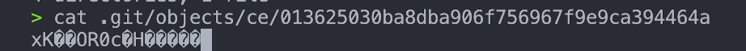
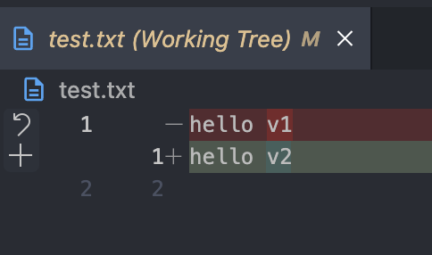
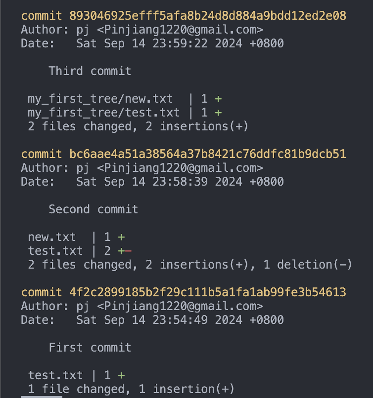

# Git internal

關於 git 內部運作，git 內部是如何追蹤每個檔案、commit、branch 等等
- 主要操作與資訊參考： [Git - Git Objects (git-scm.com)](https://git-scm.com/book/en/v2/Git-Internals-Git-Objects) 。

## Git: key-value data store

Git 以版本控制為主要功能， 而它的內部是基於 key-value data store，你可以將任何 value 存進這個 data store 中，並得到一個用來取出它的 key，透過這個 data store，就能存取各種檔案的 snapshot。除了這個 data store 外，git 也儲存了方便管理 key 的資訊（例如 branch, head 等等）。
- 每個 repo 中的 git 相關的資訊被存在 `.git` 資料中。
- 用 `git init` 後，repo 內就會建立 `.git` 資料夾，裡面儲存了所有這個 repo 中 git 需要的資料。
- 在 `.git` 資料夾中：
	- `objects` 負責儲存 git objects: blob, tree, commit
	- `refs` 負責儲存 references: branch, head, tag
	- `index`負責處理 staging area 和 working directory
## Git objects
#### blob

git 提供了一些底層指令讓使用者能直接操作較底層的功能。`git hash-object` 能依照輸入資料（value）產生對應的 unique key，並將資料儲存到 `.git/objects` 目錄中，之後就能用 key 取資料。 **blob 就是最基本儲存物件類型，就是個值（例如一個檔案的內容）。**

在用 `git init` 建立 repo 後，一開始 `.git/objects` 內只有 info 和 pack 資料夾。
```shell
> tree .git/objects
.git/objects
├── info
└── pack
```


接著用` git hash-object` 隨意存入某個東西：
```shell
> echo 'hello' | git hash-object -w --stdin

ce013625030ba8dba906f756967f9e9ca394464a
```
- `--stdin` 指定從終端機接受輸入（否則要指定要寫入的檔案）
- `-w` 寫入 object database（否則不會寫入，只會回傳 key ）

往後就可以用回傳的 key 拿到剛剛存進的內容。

> [!NOTE] 
> **Git object key**: 在 git object data store 中，這些 object 的 key 是使用 SHA-1 去 hash 檔案內容與 header 所產生的，header 包含了git object 的類別與大小。

再觀察 objects 目錄，發現多了一個目錄和檔案：
```shell
> tree .git/objects
.git/objects
├── ce
│   └── 013625030ba8dba906f756967f9e9ca394464a
├── info
└── pack
```
可以發現目錄名（前兩碼）加上檔案名就是剛剛所拿到的 key。

在 `objects` 目錄中，每一個被儲存的東西都存在一個檔案中。檔案的目錄是 key 的前兩碼，檔案名則用剩下的部分。

ps. 好奇看一下這個檔案的內容，會看到一串亂碼：
> 
（因為內容是壓縮過的）

使用用來觀察 git object 的 `git cat-file` 去看檔案：
```shell
> git cat-file -p  ce013625030ba8dba906f756967f9e9ca394464a
hello
```
- `-p`: pretty print the content


另外 `git hash-object` （在不指定 `--stdin` 時）可以計算檔案的**內容**並產生 SHA-1 key：
```shell
> echo 'hello v1' > test.txt
> git hash-object -w test.txt
d21fe316a0e9578aea75decc8c60e2a899534708
```

接下來如果修改了 test.txt，再存一次：
```shell
> echo 'hello v2' > test.txt
> git hash-object -w test.txt
a9aa67508972702119f06b0de94cbdc45516c8e5
```

可以看到 objects 內部多了兩個檔案，特別的是，儲存時只管檔案的內容，不管檔名。
```shell
> tree .git/objects
.git/objects
├── a9
│   └── aa67508972702119f06b0de94cbdc45516c8e5
├── ce
│   └── 013625030ba8dba906f756967f9e9ca394464a
├── d2
│   └── 1fe316a0e9578aea75decc8c60e2a899534708
├── info
└── pack
```

這些被存起來的內容，在 git 內部系統就叫做 blob，可以用`git cat-file -t` 觀察 object 的 type 為 blob。
```shell
> git cat-file -t d21fe316a0e9578aea75decc8c60e2a899534708
blob
```

> [!NOTE] 
> **git add 與 blob**:
> 平常 `git add` 會將檔案的 snapshot 存到 staging area。所以 `git add` 後會產生新的 blob，並且 index(staging area) 也會被更新：
>  1. 在空的 repo 中，創一個內容為 hi.txt 並 git add hi.txt 後
>  2. 可以發現 `.git/objects` 只中出現一個新的 object，觀察看看：
> ```shell
> > tree .git/objects
> .git/objects
> ├── 97
> │   └── 3748e43cf176ae7bf8f6619f4b2a1c06c4b86a
> ├── info
> └── pack
> 
> 4 directories, 1 file
> > git cat-file -p 973748e43cf176ae7bf8f6619f4b2a1c06c4b86a
> hihi%                                                                              
> > git cat-file -t 973748e43cf176ae7bf8f6619f4b2a1c06c4b86a
> blob
> ```
> 3. 至於 index (staging area) 的檔案資訊被存在 `.git/index` 中 ([refs](https://stackoverflow.com/questions/4084921/what-does-the-git-index-contain-exactly))：
> ```shell
> > git ls-files --stage
> 100644 973748e43cf176ae7bf8f6619f4b2a1c06c4b86a 0       hi.txt
> ```

即便能把內容存起來，但這些都只有「檔案」的內容，沒有對應檔名，還不足以完成版本控制需要追蹤每個「檔案」的，要追蹤檔案，還需要 tree。

----

### tree
在 Git 的 key-value data store 中，被儲存的內容主要為 tree 和 blob。
**tree 可以想像成目錄，目錄可以包含子目錄與檔案。**
blob 只有內容，而在 tree 裡有了檔案名稱，因此 tree 與 blob 合作成為一個完整的檔案們（有檔名也有檔案內容）。

每個 tree 包含 entries，一個 entry 可能是 tree 或 blob，每個 entry 同時有它的 path，type，還有 SHA-1 key（指向對應的 blob 或是 tree），tree 看起來像這樣：
```shell
$ git cat-file -p master^{tree}
100644 blob a906cb2a4a904a152e80877d4088654daad0c859      README
100644 blob 8f94139338f9404f26296befa88755fc2598c289      Rakefile
040000 tree 99f1a6d12cb4b6f19c8655fca46c3ecf317074e0      lib
```

#### 建立 tree

git 能將你的 staging area (index) 創成一個 tree。為了手動建立一個 tree，要先讓 staging area 有東西。

`git update-index` 可以將檔案內容註冊到 index (staging area) 中。

把第一版的 test.txt （存在 objects data store 中的第一版內容）加到 staging area：
```shell
git update-index --add --cacheinfo 100644 d21fe316a0e9578aea75decc8c60e2a899534708 test.txt
```
- `--add`:  因為原本 staging area 沒有 test.txt，要 add 進去。
- `--cacheinfo <mode> <object> <path>` : 可以將不在 working directory 的檔案註冊到 index，直接將指定的資訊輸入到 index 中，這裡指定將 d21fe3 物件內容 (第一版的 test.txt) 以 test.txt 放入 index。mode 是指檔案模式：一般檔案、執行檔等等）

於是 staging 中出現了第一版 test.txt：




再來就能將 staging area 以 tree 存起來：
```shell
> git write-tree
6a48d63e943686e85ea53e723d0777891369db15
```

看一下這個 tree，包含了 test.txt 檔案和它的資訊：
```shell
> git cat-file -p 6a48d63e943686e85ea53e723d0777891369db15
100644 blob d21fe316a0e9578aea75decc8c60e2a899534708    test.txt
```

再創一個 tree，這次改用一個第二版 test.txt 和一個新檔案
```shell
> git update-index --cacheinfo 100644 a9aa67508972702119f06b0de94cbdc45516c8e5 test.txt
> echo 'new file' > new.txt
> git update-index --add new.txt


> git write-tree
dbb963c9308e5f11a30f661f22476e0ab41a0817
> git cat-file -p dbb963c9308e5f11a30f661f22476e0ab41a0817
100644 blob fa49b077972391ad58037050f2a75f74e3671e92    new.txt
100644 blob a9aa67508972702119f06b0de94cbdc45516c8e5    test.txt
```
這個 tree 裡的 test.txt 的 SHA-1 key 用的就是第二版了。

還可以把 tree 讀出來放到 index 中，指定 `--preifx` 設定 tree 要放到的 path，再寫一個新的 tree
```shell
> git read-tree --prefix=my_first_tree 6a48d63e943686e85ea53e723d0777891369db15
> git write-tree
762f698814999a48cdd3d50abfaca5aa6b76a222
```


觀察這個 tree，確實有一個 subtree 在 my_first_tree ：
```shell
> git cat-file -p 762f698814999a48cdd3d50abfaca5aa6b76a222
040000 tree dbb963c9308e5f11a30f661f22476e0ab41a0817    my_first_tree
100644 blob fa49b077972391ad58037050f2a75f74e3671e92    new.txt
100644 blob a9aa67508972702119f06b0de94cbdc45516c8e5    test.txt
```

### commit
現在 git 可以記住檔案內容、檔名、多個檔案了，但這些 SHA-1 key 怎麼管理，每次都要自己記下來？因此就需要 commit。commit 也是一個 git object，它儲存了對應的 tree 和訊息、時間、作者等等資訊。
#### 建立 commit tree
用第一個建立的 tree 創個 commit tree：
```shell
> echo 'First commit' | git commit-tree 6a48d63e943686e85ea53e723d0777891369db15
4f2c2899185b2f29c111b5a1fa1ab99fe3b54613

> git cat-file -p 4f2c2899185b2f29c111b5a1fa1ab99fe3b54613
tree 6a48d63e943686e85ea53e723d0777891369db15
author pj <Pinjiang1220@gmail.com> 1726329289 +0800
committer pj <Pinjiang1220@gmail.com> 1726329289 +0800

First commit
```

依序照剛剛之前 tree 建立的順序，建立對應的 commit，並以 `-p` 指定該 commit 的 parent
```shell
> echo 'Second commit' | git commit-tree dbb963 -p 4f2c28
bc6aae4a51a38564a37b8421c76ddfc81b9dcb51
> echo 'Third commit' | git commit-tree 762f69 -p bc6aae
893046925efff5afa8b24d8d884a9bdd12ed2e08
```

看看最後的 commit：
```shell
git log --stat 893046925efff5afa8b24d8d884a9bdd12ed2e08
```

 

要注意的是，`git commit-tree`和平常 `git commit` 是不一樣的，`git commit` 是**在目前的 branch 上**做新的 commit，而這裡的 `git commit-tree` 是做一個 commit object，並沒有關於 branch 的資訊。

----

## Git references
在上一個章節，看 commit tree objects 時還是得用 SHA-1 去看，這不太方便，最好可以用個好記的別名 （reference）去代替 SHA-1，平常用的 branch 就算是一種 references，

references 被存在 `refs` 目錄中，在沒有任何 `git commit` 之前，refs 只有 heads 和 tags 資料夾。
```shell
> tree .git/refs
.git/refs
├── heads
└── tags
```
### branch
branch 是一個指向某個 commit 的指標。

從剛才最後的 commit object 建立一個名為 hello 的 branch：
```shell
git branch hello 893046925efff5afa8b24d8d884a9bdd12ed2e08
```

ps. 上面的指令等同於：
```shell
> cat .git/refs/heads/hello
893046925efff5afa8b24d8d884a9bdd12ed2e08
```

現在 `refs/heads` 中多了 `hello`，`hello` 的內容是剛剛給的 commit 的 SHA-1。之後如果切到別的 branch，要回來 hello 這條 branch，git 就知道要切到哪個 commit 了。
```shell
> tree .git/refs
.git/refs
├── heads
│   └── hello
└── tags

> cat .git/refs/heads/hello
893046925efff5afa8b24d8d884a9bdd12ed2e08
```

### head
head 代表了目前在的 branch。head 通常是指向某個 reference，但有時會直接指向某個 git object 而不是 reference，這種時候就被稱為 `DETACHED HEAD`。

head 所存的 refs 寫在 `.git/head` 中，例如原本在 main branch：
```shell
> cat .git/HEAD
ref: refs/heads/main
```

切換到 hello branch：
```shell
> git checkout hello
Switched to branch 'hello'
> cat .git/HEAD
ref: refs/heads/hello
```

切換到某個 commit 而不是 branch，跳出來的 `DETACHED HEAD` 警告在這之後做的變更不會影響到 branch：
```shell
> git checkout bc6aae4a51a38564a37b8421c76ddfc81b9dcb51
Note: switching to 'bc6aae4a51a38564a37b8421c76ddfc81b9dcb51'.

You are in 'detached HEAD' state. You can look around, make experimental
changes and commit them, and you can discard any commits you make in this
state without impacting any branches by switching back to a branch.

If you want to create a new branch to retain commits you create, you may
do so (now or later) by using -c with the switch command. Example:

  git switch -c <new-branch-name>

Or undo this operation with:

  git switch -

Turn off this advice by setting config variable advice.detachedHead to false

HEAD is now at bc6aae4 Second commit
```

---

## Commit message style

如何寫 Commit message：
- 第一行寫標題，盡量精準寫下這次改動的目的
	- 可以的話不要太長（大約 80 個字母內），如果很長，可以想想是不是 commit 太大包
	- 開頭可以寫下 commit 的類型，像是 fix, feat(增加功能) 等等，例如 `fix: fix xxxx` 或是 `feat: add xxxx` 等等
- 標題後就寫其他資訊，例如可以條列主要改動的部分
	- 寫其他資訊前，與標題之間要空行（沒有空行會變成全部都是標題）
- 若有整合追蹤工具，團隊能討論要在哪裡寫上提供追蹤的追蹤編號
	- 例如標題前、最後等等

（團隊或是個人）不論如何決定，盡量決定好一個規範並遵循，避免每個 commit 都不一樣的 style 
- 都不一樣 style 可能導致整合自動化流程不便，人類看也比較累

---

## Ref
- [Git - Plumbing and Porcelain (git-scm.com)](https://git-scm.com/book/en/v2/Git-Internals-Plumbing-and-Porcelain)
- [Git - Git References (git-scm.com)](https://git-scm.com/book/en/v2/Git-Internals-Git-References)
- [Git - Git Objects (git-scm.com)](https://git-scm.com/book/en/v2/Git-Internals-Git-Objects)
- [Commit message guidelines (github.com)](https://gist.github.com/robertpainsi/b632364184e70900af4ab688decf6f53)
- [internals - What does the git index contain EXACTLY? - Stack Overflow](https://stackoverflow.com/questions/4084921/what-does-the-git-index-contain-exactly)