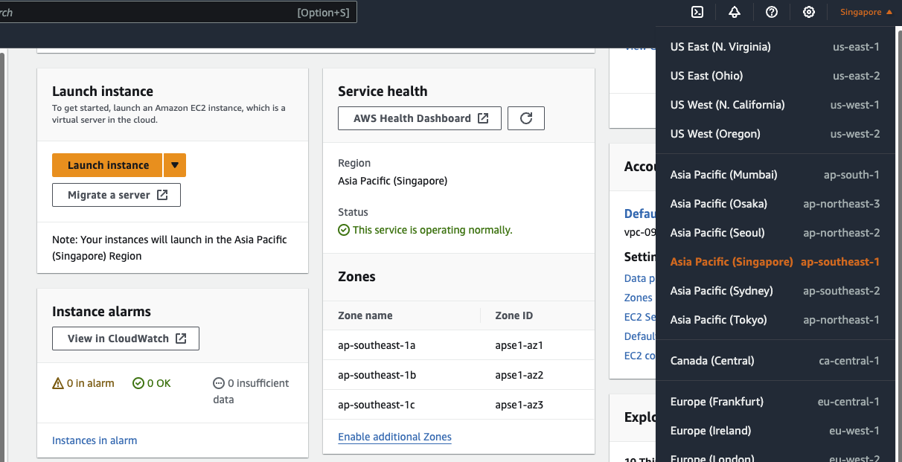
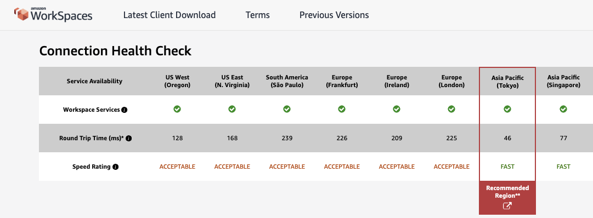

# Week 03

## HW checklist

WIP

- [x] A. 註冊 AWS 帳號與回答問題: [README.md](README.md)
- [x] B. Callback 練習: [callback.js](callback.js)
  - [x] [進階] 怎麼用 Promise 來改善？: [promise.js](promise.js)
- [x] C. 建立 Express 專案與回答問題: [backend/README.md](../backend/README.md)
  - [ ] [進階題][localhost](http://localhost) 是什麼？
  - [ ] [進階題]`curl` 是什麼？查查看怎麼用 curl 來測試網路連線？常用參數有哪些？
- [ ] D. 分組

---

## AWS Region and Availability Zones

> 什麼是 AWS Region, AZ (availability zones)

AWS Region 是 AWS 放 data center 的地理位置，包含了北美、南美、亞洲各地等等，使用者可以依照需求選擇服務的 region。

每個 Region 中至少會有三個以上 Availability Zone (簡稱 AZ)，這些 AZ 之間有低延遲的網路連接，它們在地理位置與基礎環境（例如電力）上彼此隔離，增加了容錯性，AWS 的使用者可以將自己的服務設計成能執行在多個 AZ 中，當一個 AZ 不幸壞了，還有其他的能替代。

實際點進 AWS console -> EC2 (AWS 雲端 server)， 可以從 Service health 中看到目前選的 region (右上角可選 region，例如圖片是選新加坡 `ap-southeast-1`) 中提供的三個 AZ：

> [!NOTE]
> 目前還沒有台灣的 region，但 AWS 在明年會提供[台北的 region](https://aws.amazon.com/tw/local/taipei/)。

### Region 挑選

> 如果你要使用 AWS 服務，你會怎麼選擇用哪個 Region，考慮的因素有哪些？

選擇 region 的主要考量點：

- 距離（延遲）：距離的遠近會影響網路延遲（[AWS Region 延遲測試](https://clients.amazonworkspaces.com/Health.html)）
- 價錢：每個服務在不同 region 會有價錢上的差別（[EC2 價錢查詢](https://aws.amazon.com/tw/ec2/pricing/on-demand/#On-Demand_Pricing)、[各服務價錢試算](https://calculator.aws/#/)）
- 支援的服務：有些新 AWS 服務可能只在大型 region 中才支援
- 法律規範：資料保存是否牽涉法律規範。例如與政府機密資料相關，當地法規規定資料必須留在國內

基本上根據需求而定，例如：要選課堂專案 EC2 要用的 region，因為用免費方案可忽略價錢小差異，如果只考慮速度，用[延遲測試](https://clients.amazonworkspaces.com/Health.html)可以發現東京可能是個不錯的選擇：

### Ref

- [AWS: Regions and Availability Zones](https://aws.amazon.com/about-aws/global-infrastructure/regions_az/?nc1=h_ls)
- [AWS UserGuide: Regions and Zones](https://docs.aws.amazon.com/AWSEC2/latest/UserGuide/using-regions-availability-zones.html#concepts-availability-zones)
- [What to Consider when Selecting a Region for your Workloads](https://aws.amazon.com/tw/blogs/architecture/what-to-consider-when-selecting-a-region-for-your-workloads/)
