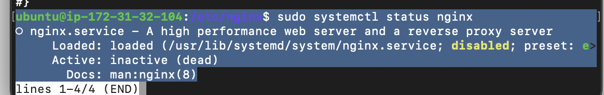
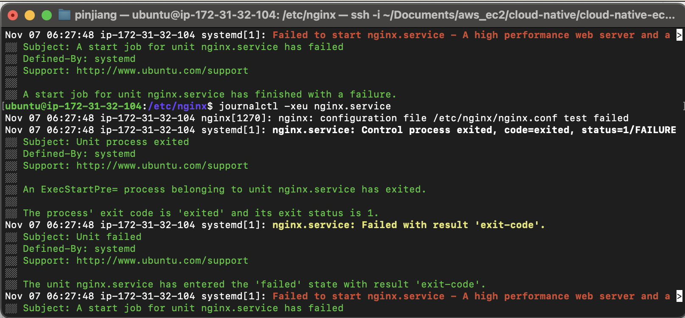
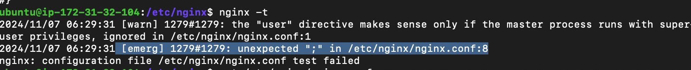
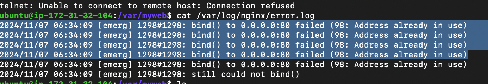
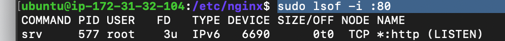
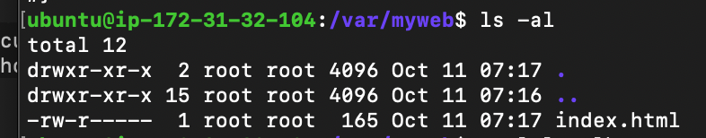
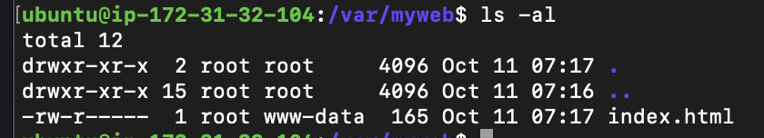
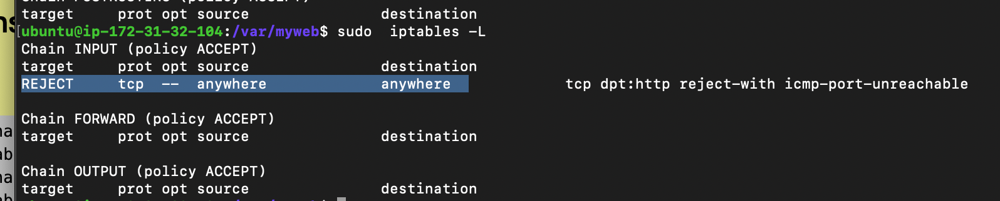
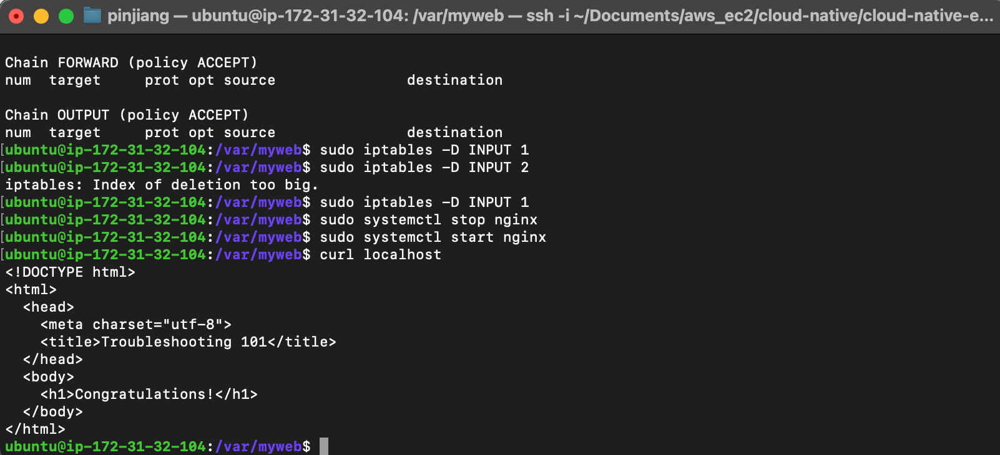

## nginx.conf syntax error

啟動 nginx 會出現錯誤：


使用 journalctl 指令可以看到 configuration file /etc/nginx/nginx.conf test failed


使用 nginx -t 檢測，發現 nginx.conf 第八行多個分號，把它改好：


## Port 被佔用

發現 nginx 還是有錯：


port 被佔用，用 lsof 看 pid 並把 process 殺掉 (`kill [pid]`)


不過 curl 還是出現錯誤： Failed to connect to localhost port


## static file 權限問題

組員發現 `/var/log/myweb/error.log` 有出現 `/var/myweb/index.html` Permission denied 的 log，雖然是很久之前 10 月多的 log，但去看 index.html 確實可以發現擁有者是 root，所以先改一下 index.html 的權限
更改前：


更改 owner 成 www-data （可以在 nginx.conf 裡面看到 user 是 www-data）：

```
sudo chown :www-data index.html
```



## iptables

有同學在 DC 提醒可以看 iptables，發現有一條 REJECT tcp 的 rule


把這條 rule 刪掉：

```
sudo iptables -D INPUT 1
```

重開 nginx，修好了


---

## Reboot 後設定

- 更改 iptables 的永久設定，不然每次重開都會復原：
  - 將目前 iptables 寫入 rules.v4：
  - `sudo sh -c "iptables-save > /etc/iptables/rules.v4"`
- 停用 service srv，讓他開機後不要跑起來
  - `sudo systemctl disable srv`
- 啟用 nginx，讓他開機後自動啟動
  - `sudo systemctl enable nginx`

---

## 心得

解到一半卡在 iptables 設定時，若沒有同學來 DC 分享，不知道還會卡多久，感謝這位同學，也讓我知道還有 iptables 這個東西的存在

後續跟小組討論進階題（reboot 後也要是好的）發現 iptables 指令只會影響當下，如果要讓重開機後也是好的，要設定 `reuls.v4`，然後還要防止 srv 自動跑起來要 disable，以及 nginx 要打開

途中很有印象是改一改配置檔案，跳出 disk 空間不夠不能改 XD，原來老師塞了一堆超大檔案 XDD，也是因為組員分享，學到了根據檔案大小找檔案的指令

第一次上課體驗到這樣的 debug 活動，覺得非常有趣，有種在玩解謎遊戲的感覺 XD

ps. 卡在 iptables 時，也有跑去檢查 DNS，想說會不會是不知道怎麼解析 localhost 之類的，結論是正常 XD
