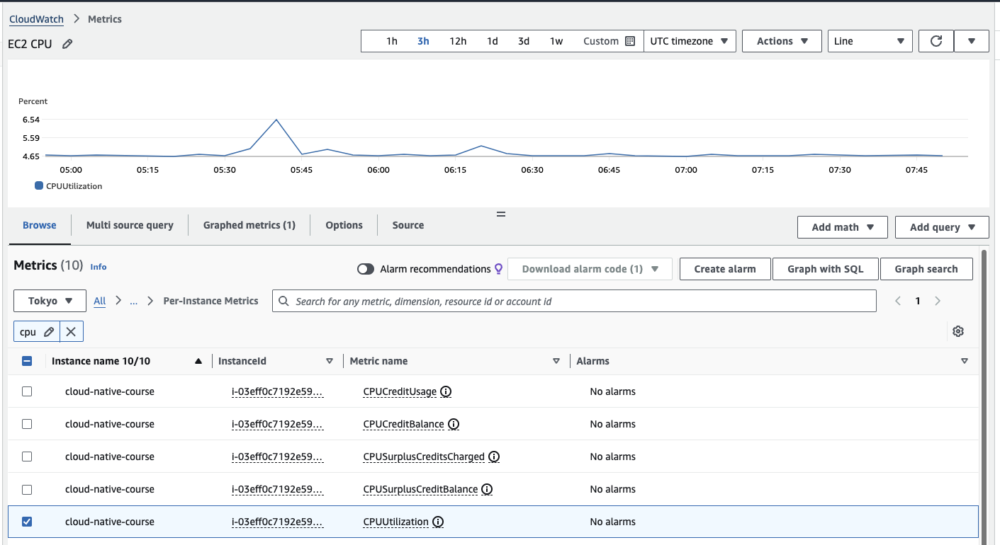
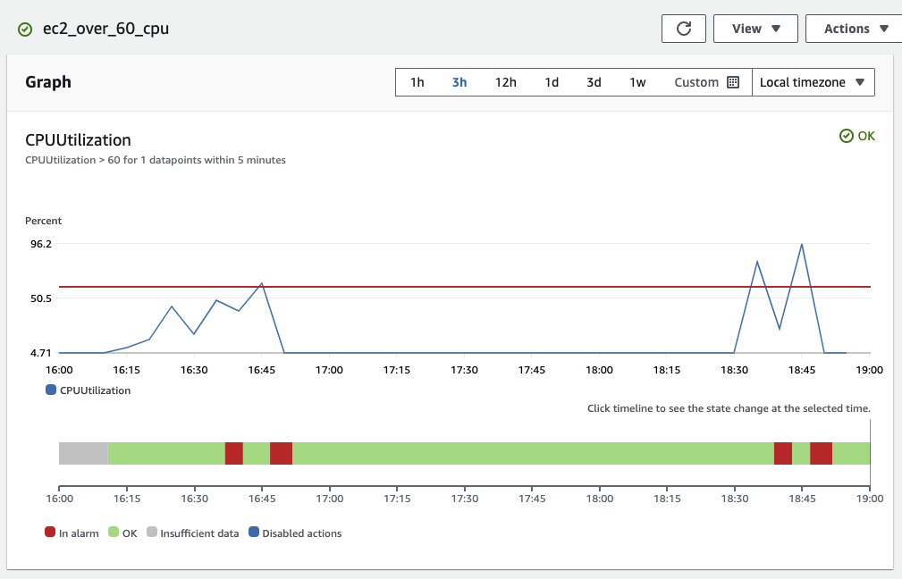
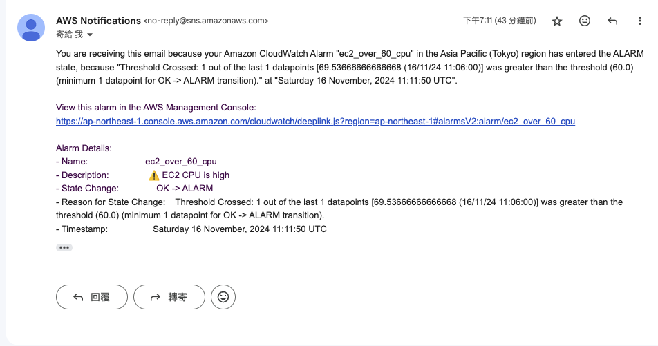
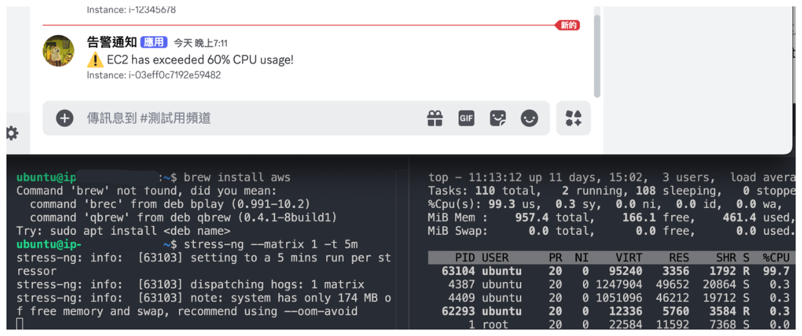
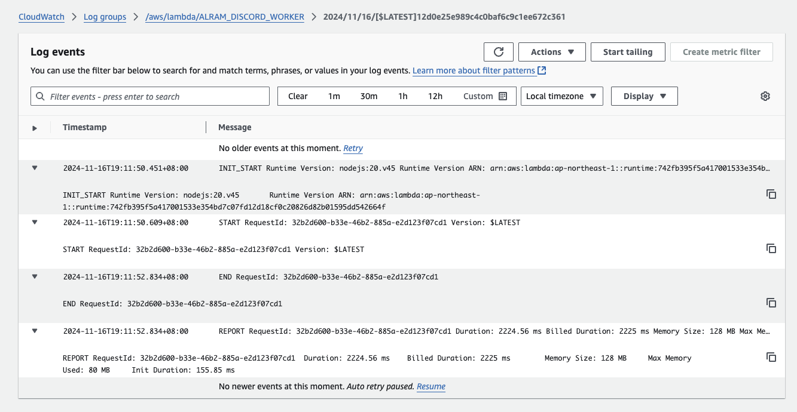
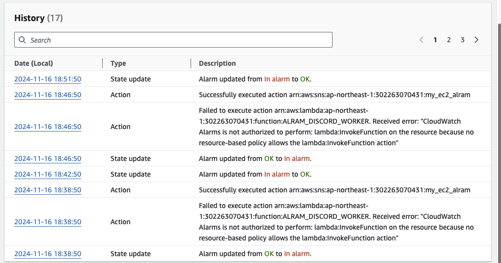

# Week 10: Monitor & Notification Lab

- [x] AWS CloudWatch Metrics - CPUUtilization 的截圖
    - /week-10/metrics.png
- [x] AWS CloudWatch Alarm 圖表的截圖
    - /week-10/alarm-graph.png
- [x] 收到通知的截圖
    - /week-10/alarm-email.png

進階題:
- [x] [Lambda function 程式](#lambda-function-程式)
- [x] Discord 接收到訊息的截圖
    - /week-10/lambda-discord.png
- [x] AWS CloudWatch Logs 擷取 Lambda Function 執行 log 的截圖
    - /week-10/lambda-logs.png

----

## AWS CloudWatch Metrics - CPUUtilization 的截圖



## AWS CloudWatch Alarm 圖表的截圖



壓力測試用 stress-ng：

```shell
// 使用進行矩陣計算的 stressor 持續 5 分鐘
stress-ng --matrix 1 -t 5m
```

參考資料：

- [stress-ng ubuntu 安裝](https://github.com/ColinIanKing/stress-ng?tab=readme-ov-file#debian-packages-for-ubuntu)
- [stress-ng 指令與參考文章](https://wiki.ubuntu.com/Kernel/Reference/stress-ng)

## 收到通知的截圖

因為取樣頻率是設定 5 分鐘，不會一壓測就觸發 alarm，但等個幾分鐘就能收到 email


## Alarm 觸發 Lambda 發通知到 Discord

使用 Discord webhook，用 HTTP POST 訊息到 DC 頻道的 webhook URL 即可發送通知
- 需要先在 DC 伺服器建立 or 拿到某個頻道的 Webhook URL
- [Discord Execute Webhook API Doc](https://discord.com/developers/docs/resources/webhook#execute-webhook)

Notes：

- Q：是否可以在 cloudwatch invoke 的 lambda input 帶入自定義 event input？
- A：不行，但是 [cloud watch 有固定的 event](https://docs.aws.amazon.com/zh_tw/AmazonCloudWatch/latest/monitoring/AlarmThatSendsEmail.html#alarms-and-actions)，所以可以在通知裡加一些關於 alarm 的資訊，例如以下程式就加入了 instanceID，假設有多個 EC2 都要監控，就能看出是哪一個 instance，~~雖然用免費方案應該不會有多個 EC2~~

### Lambda function 程式

```js
import http from "https";

async function sendDiscordAlram(webhookUrl, event) {
  try {
    let instanceId = "cannot_parse_id";
    try {
      instanceId =
        event.alarmData.configuration.metrics[0].metricStat.metric.dimensions
          .InstanceId;
    } catch (err) {
      console.log(`parsing instance id failed: ${err}`);
    }

    const response = await fetch(webhookUrl, {
      method: "POST",
      body: JSON.stringify({
        content: `:warning: EC2 has exceeded 60% CPU usage!\n-# Instance: ${instanceId}`,
        username: "告警通知",
        avatar_url: "https://i.imgur.com/i1KO4EQ.png",
      }),
      headers: { "Content-type": "application/json; charset=UTF-8" },
    });
    return response;
  } catch (error) {
    console.log(error);
    return error;
  }
}

export const handler = async (event) => {
  const res = await sendDiscordAlram(process.env.DISCORD_WEBHOOK_URL, event);

  const response = {
    statusCode: 200,
    body: JSON.stringify(res),
  };
  return response;
};
```

#### Discord 接收到訊息的截圖



### AWS CloudWatch Logs 擷取 Lambda Function 執行 log 的截圖


截完才發現程式沒有埋錯誤以外的 log，所以除了基本的執行資訊看不出什麼東西

---

## Troubleshooting: Alarm 沒有觸發 lambda

加好 alarm 觸發 email 跟 lambda 後，發現都只有 email 有發送，lambda 都沒被被 alarm 觸發，所以從 Alarm -> History 裡看 Alarm 的紀錄，就能找到錯誤訊息



原因是 cloudwatch 沒有權限執行 lambda：

```
error": "CloudWatch Alarms is not authorized to perform: lambda:InvokeFunction on the resource because no resource-based policy allows the lambda:InvokeFunction action"
```

解決方法是使用 aws 指令增加權限（[參考文件](https://docs.aws.amazon.com/AmazonCloudWatch/latest/monitoring/AlarmThatSendsEmail.html#alarms-and-actions-Lambda)）：

在使用指令之前，需先安裝 awc CLI 並建立 profile，如果沒有 access key，要去 IAM 裡建立一組 access key。

為了方便，我建立了一個 User 並給它 AdministratorAccess 權限的 User group，得到 access key ID 和 secrets 後，就能用 aws configure 建立 profile。

```shell
aws lambda add-permission \
--function-name ${FUNCITON_NAME} \
--statement-id AlarmAction \
--action 'lambda:InvokeFunction' \
--principal lambda.alarms.cloudwatch.amazonaws.com \
--source-account ${YOUR_ACCOUNT_ID} \
--source-arn ${YOUR_ALARM_URN} \
--profile ${YOUR_AWS_PROFILE}
```

接著再壓測一次，lambda 就有成功被 alarm 觸發了～
